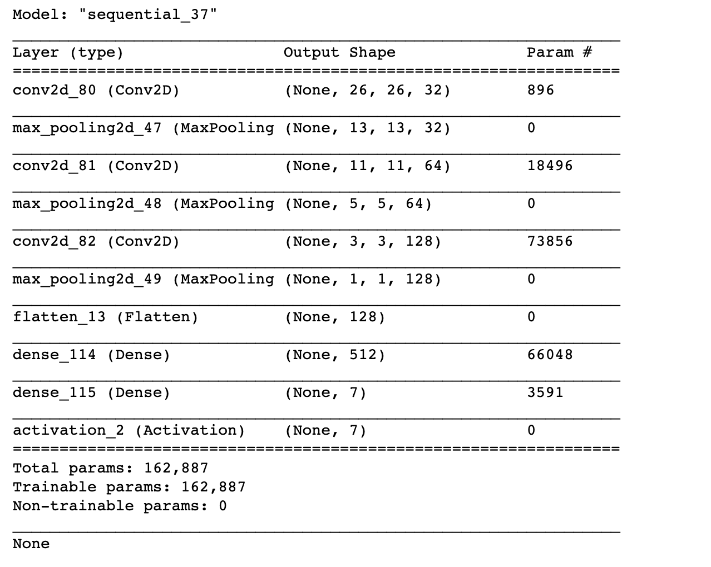
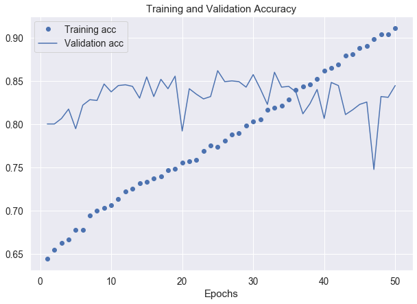
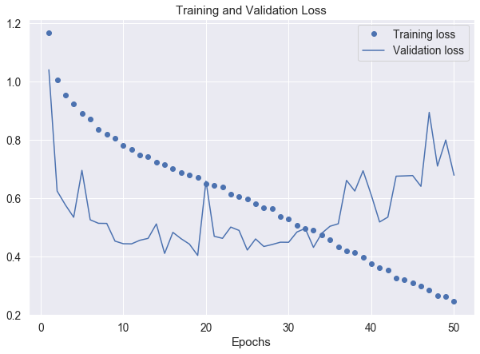

 # Module 4 Final Project: Using Deep Learning to Detect Skin Cancer Types

## Introduction
For this module project, I will attempt to use deep learning to classify images across 7 different skin cancer types: 

* nv: Melanocytic nevi -- benign neoplasms 
* mel: Melanoma  -- malignant neoplasm
* bkl: "Benign keratosis" -- a generic class
* bcc: Basal cell carcinoma -- a common variant of epithelial skin cancer
* akiec: Actinic Keratoses (Solar Keratoses) and intraepithelial Carcinoma (Bowen’s disease) -- common non-invasive variants
* vasc: Vascular skin lesions 
* df: Dermatofibroma is a benign skin lesion 

## Techniques Employed
To do this, I employed the help of a convolution neural net or CNN. A CNN is different from your run-of-the-mill neural net in that it does not flatten to just the pixels. Rather, it uses a "filter" to figure out the edges and other important features of the images all while not making a computational intensive scan of a multi-dimensional object.

## Results & Conclusions
* Our precision score for the deep learning CNN turned out to be 0.8393080781723388; this suggests that either the CNN did not pick up enough of the true positives to be effective
* Our recall score for the deep learning CNN turned out to be 0.8449682683590208; this suggests that there was a slight bloat in false positives among some of the classes.
* These could be caused by the class imbalance that existed between the training and validation sets. 

## Contents
This repo contains the following:
* Module_4_Project_README.md - Bing! You're here
* Module 4 Final Project - Deep Learning to Classify Skin Cancer.ipynb - the Jupyter Notebook of my code
* sample_skin_lesions.png - A gross look at the different types of skin cancers
* Module_4_Blog - A link to my Learn.co blog on Transfer Learning
* Module_4_Presentation_pdf - a pdf version of my PowerPoint presentation (non-technical)

## Requirements.txt
The libraries used for this project include: 
* import os # For sorting file paths
* import pandas as pd # For dataframe manipulation
* import numpy as np # For math related manipulation
* import glob # for path sticking
* from sklearn.model_selection import train_test_split # For train-test splitting
* import seaborn as sns # For visualization
* sub-library set: sns.set(color_codes = True) 
* import matplotlib.pyplot as plt # For visualization
* %matplotlib inline

## Results Visualizations and Test Scores
### Convolutional Neural Net Architecture

### Validation and Training Accuracy

### Validation and Training Loss

### Test Results
precision: 0.8393080781723388
recall: 0.8449682683590208
fscore: 0.840178946950353

## Future Work
* Establish a true test set
* Generate a way of making the classes less imbalanaced
* Focuse on the classification of one or two different types of melanomas, then use this model for VGG transfer learning on a greater variety as scaled (I started to do this but ran into dimensional problems in the end)

## Built With:
Jupyter Notebook
Python 3.8
scikit.learn

## Authors
Kevin McPherson

## Acknowledgments
Thank you to our instructor, Abhineet Kulkarni for his suggestions

